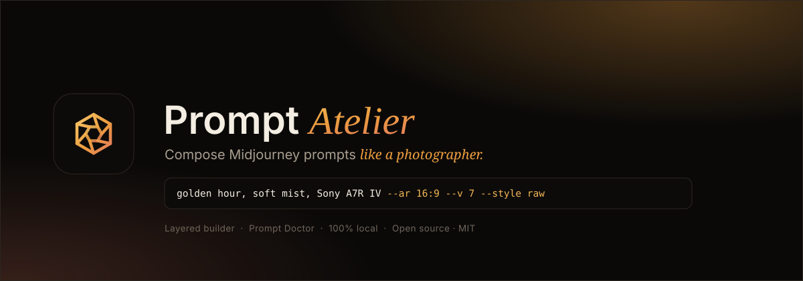

<p align="center">
  <a href="https://prompt-atelier-zeta.vercel.app"></a>
  <a href="#license"></a>
  
  
  
  
</p>

<p align="center">
  <b><a href="https://prompt-atelier-zeta.vercel.app">▶&nbsp; Try the live demo</a></b>
</p>

# Prompt Atelier

**A beautifully crafted, open-source prompt builder for Midjourney.** Compose
photorealistic prompts layer by layer — framing, subject, light, camera, render —
and let the built-in **Prompt Doctor** catch the mistakes that quietly ruin a
render before you ever spend a generation on them.

No sign-up, no API key, no backend. Everything runs locally in your browser.

> Most prompt tools are a single text box and a wall of random "magic words."
> Great images don't come from stacking *8k ultra hd masterpiece* — they come
> from a **method**. Prompt Atelier encodes that method into the interface.

---

## Why Prompt Atelier?

Getting a consistently photorealistic result out of Midjourney is less about
secret keywords and more about **structure**. Prompt Atelier is opinionated on
purpose:

- 🎞️ **Light comes first.** Lighting and atmosphere are the single biggest
  driver of realism, so the *Light & atmosphere* layer is highlighted as the
  high-impact field — not buried among detail modifiers.
- 🧱 **Layered, not a blank box.** A proven order — `framing → subject → scene
  layers → light → camera → render` — keeps prompts coherent and readable.
- 🩺 **A linter for prompts.** The Prompt Doctor flags the classic failure modes
  in real time (see below) instead of letting you learn them one wasted render
  at a time.
- 🎚️ **Parameters you can reason about.** `--ar`, `--style raw`, `--s`, `--c`,
  `--q`, `--seed`, `--sref`/`--sw`, `--hd` and `--draft` — each with sensible
  ranges, defaults and inline guidance.
- 🎨 **Built by a designer.** A calm "golden hour studio" interface that's
  genuinely pleasant to spend time in.

## Features

| | |
|---|---|
| **Layered builder** | Seven composable layers, each with a curated chip library you can toggle in and out. |
| **Prompt Doctor** | Live diagnostics: missing light, missing `--style raw`, over-long prompts, stacked "magic words", illustration vocabulary in a photo prompt, and runaway stylize. |
| **Recipes** | One-click presets — *Photoreal landscape*, *Cinematic portrait*, *Architecture & interior*, *Product still life* — that you can tweak from there. |
| **Live prompt** | The final, copy-paste-ready string assembles in real time, with word and character counts. |
| **History** | Your last prompts are saved locally so you can return to a good one. |
| **Local-first** | No accounts, no telemetry, no network calls. Your prompts never leave the page. |

## The method it encodes

Prompt Atelier is built around a layered photorealism formula:

```
[framing] + [specific subject] + [foreground → background layers]
          + [light / time / weather / atmosphere ⭐]
          + [camera / lens / film] + [2–3 render terms] + [parameters]
```

…and the **Prompt Doctor** watches for the mistakes that most often break that
formula:

| Check | Why it matters |
|---|---|
| Light undefined | Light is the #1 realism factor — `golden hour`, `blue hour`, `mist`, `god rays` beat any "quality" word. |
| Missing `--style raw` | Essential for photographic looks; without it Midjourney over-stylizes. |
| Prompt over ~40 words | Past that, Midjourney starts diluting focus. |
| Stacked "magic words" | `8k`, `ultra hd`, `masterpiece` add nothing — define light and camera instead. |
| Mixed vocabulary | `illustration` / `anime` terms contradict a photo prompt. |
| Runaway `--s` | High stylize is more cinematic but drifts from your prompt. |

## Getting started

```bash
# clone, then:
npm install
npm run dev      # http://localhost:5173
```

Build for production (deploys as static files to GitHub Pages, Netlify, Vercel,
or any static host — `base` is already relative):

```bash
npm run build
npm run preview
```

## Tech stack

- **React 19** + **TypeScript** (strict)
- **Vite 8** for dev/build
- **Tailwind CSS v4** with a small custom token theme
- Zero runtime dependencies beyond React — no UI kit, hand-built components

## Project structure

```
src/
├─ data/        curated chip libraries + recipe presets
├─ lib/         prompt assembler, diagnostics ("Prompt Doctor"), storage, types
├─ components/  UI: builder fields, parameters, live preview, doctor, history
└─ App.tsx      state + composition
```

## Roadmap

- [ ] Shareable prompt links (encode state in the URL)
- [ ] Export / import prompt sets as JSON
- [ ] More recipes (street, food, automotive, macro nature)
- [ ] A "Niji" illustration mode with its own chip library and checks
- [ ] Optional Spanish / multi-language UI

Ideas and pull requests are welcome — see an issue you'd like to take? Open one.

## Contributing

1. Fork the repo and create a branch.
2. `npm install && npm run dev`.
3. Keep it type-safe (`npm run build` must pass) and match the existing style.
4. Open a pull request describing the change.

## License

[MIT](LICENSE) © Patricio Molina
